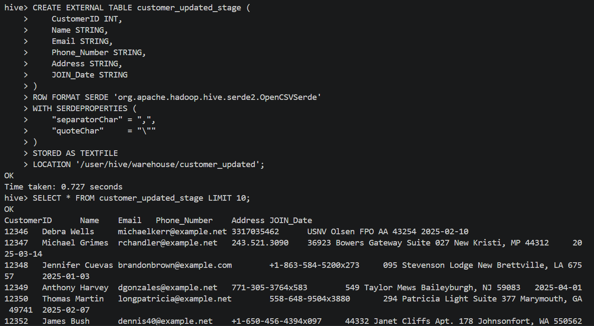
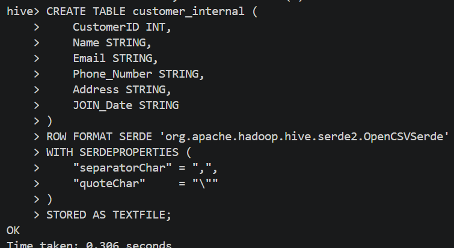
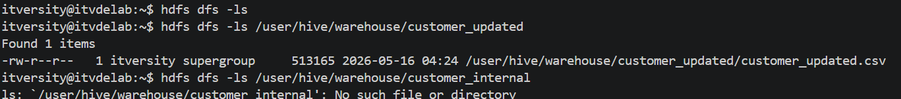
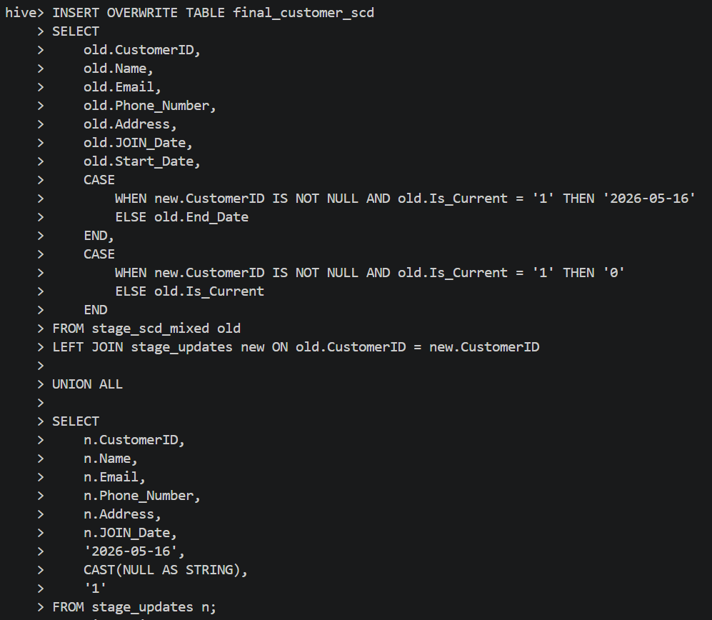
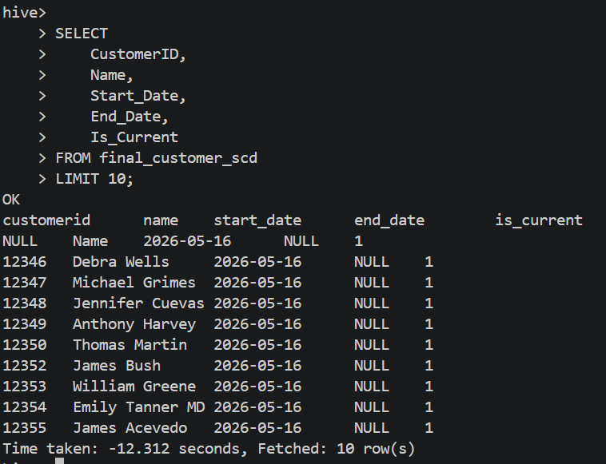

# 📊 Hive Data Engineering Lab: SCD Type 2 Process 🚀
## 📝 Introduction
This report documents the step-by-step implementation of the Hive Assignment, focusing on data management, SerDe usage, and implementing Slowly Changing Dimensions (SCD Type 2) without transactional tables.

## 🛠️ Phase 1 & 2: Table Creation, Loading & Delimiter Handling
In this initial stage, I created both Internal and External tables. To ensure the data was parsed correctly, I addressed the issue where commas within the Address column caused column shifting.

Solution: Used OpenCSVSerde during the table creation phase. This allowed Hive to respect quoted strings, ensuring that addresses containing commas were treated as a single field.

Action: Loaded the datasets into customer_internal and customer_external using this configuration.

## 🛠️ Phase 3: The Drop Table Experiment
Testing the fundamental difference between table types by dropping them.

Observation: After dropping the External table, the data file remained in HDFS.

Observation: After dropping the Internal table, Hive deleted both the table definition and the physical data.

## 🛠️ Phase 4: Initializing the SCD Type 2 Dimension
Created the primary dimension table customer_scd2_mixed.csv to serve as the historical baseline.

Structure: Added tracking columns: Start_Date, End_Date, and Is_Current.

## 🛠️ Phase 5: Incremental Loading & History Tracking
Using the customer_updated.csv file, I implemented the logic to update existing customer records and insert new ones.

New Records: Assigned End_Date = NULL and Is_Current = '1'.

Changed Records: Old versions were updated to Is_Current = '0' with a specific End_Date.

## 🛠️ Phase 6: The SCD Type 2 Workaround
Since Hive doesn't support traditional UPDATE or DELETE on standard tables, a strategic workaround was used to avoid using Transactional tables.

The Method: An Insert Overwrite strategy combined with a Left Join between the old dimension and the new updates.

Outcome: This successfully simulated SCD Type 2 behavior while keeping the tables non-transactional.

## ✅ Conclusion
The lab successfully demonstrated how to manage historical data changes in Hive through efficient SerDe selection and clever data merging techniques.

Developed by: Qassam Saeedi 👨‍💻
Date: May 2026