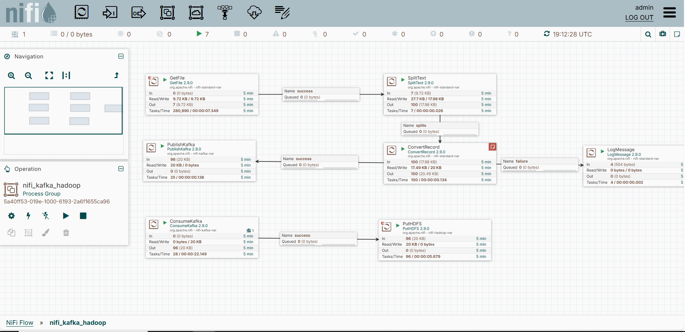
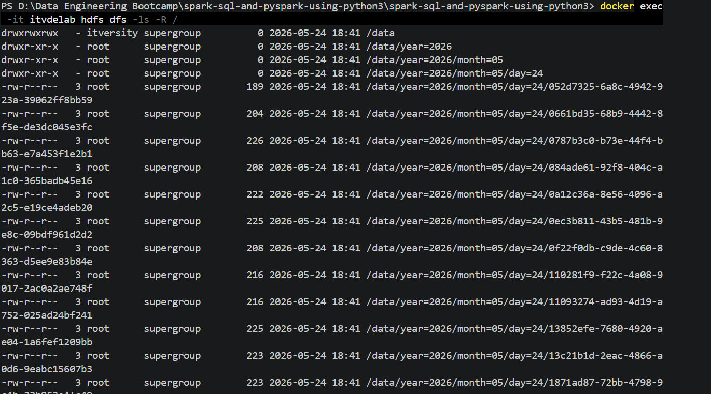

# 🛒 Enterprise Real-Time eCommerce Data Pipeline Engine

An enterprise-grade, event-driven streaming data pipeline built to ingest, validate, decouple, and persist high-velocity eCommerce transactional logs into a distributed Data Lake. This project showcases production-ready integration of the Modern Data Stack, leveraging **Docker Containerization**, **Apache NiFi Flow Engineering**, **Apache Kafka Distributed Messaging**, and **Hadoop Distributed File System (HDFS)** cluster topology.

---

## 🏗️ 1. Architecture Topology

The infrastructure follows a decoupled, highly resilient streaming layout designed to guarantee transactional integrity, handle malformed data schemas dynamically, and implement high-efficiency storage partitioning.

[ Programmatic Streamer ] ──(Real-Time CSV)──> [ Apache NiFi Ingestion ]
                                                        │
                                                [ Schema Validation ] ──(Malformed)──> [ Log Failure / Alert ]
                                                        │
                                                     (Valid JSON)
                                                        │
                                                        ▼
[ Distributed Data Lake ] <──(HDFS Storage)── [ Apache Kafka Queue ]

---

## 🛠️ 2. Core Infrastructure Components

* **Ingestion Engine:** Apache NiFi (v2.9.0) managing live data lineage, file system monitors, and transactional metadata extraction.
* **Message Broker:** Apache Kafka (Confluent Platform v7.4.1) serving as a distributed backpressure and decoupling layer.
* **Storage Tier (Data Lake):** Hadoop HDFS (via itversity/itvdelab:latest) executing distributed write operations across standard blocks.
* **Container Orchestration:** Docker & Docker Compose unifying storage volumes, port routing, and custom bridge networking.
* **Data Generation Tier:** Python 3 embedded with the Faker telemetry library to simulate complex, irregular real-world transaction payloads.

---

## 🚀 3. Deployment & Execution Guide ("How to Run")

Follow these precise sequential stages to deploy the cluster infrastructure and execute the real-time data stream:

### Step 1: Initialize the Containerized Stack
Navigate to your project directory containing the docker-compose.yml file and launch all background microservices:
> docker-compose down
> docker-compose up -d

### Step 2: Import the NiFi Data Definition Layout
1. Open up the Apache NiFi user interface at https://localhost:8443/nifi.
2. Right-click on the canvas grid and choose **Upload Process Group**.
3. Select your exported NiFi Data Definition template file (e.g., definition.json or flow.json) which encapsulates the entire engineered flow structure.
4. Drag and instantiate the Process Group onto the main workspace canvas.

### Step 3: Boot Up Distributed Hadoop Core Services
Hadoop services within the cluster container must be manually awakened to start receiving RPC write streams. Execute the following pipeline triggers:
> docker exec -it itvdelab bash
> start-dfs.sh
> jps

### Step 4: Provision Storage Security Privileges
Configure open write permissions across the root HDFS architecture block so that the containerized NiFi process can dynamically create landing zones:
> hdfs dfs -chmod 777 /
> hdfs dfs -mkdir -p /data
> hdfs dfs -chmod 777 /data

### Step 5: Activate the Telemetry Stream Script
Run your programmatic Python simulation engine to start broadcasting transactional telemetry logs into the shared host landing zone folder:
> python stream_data.py

### Step 6: Trigger the Flow Controller
Return to your NiFi workspace canvas, select the root process controller group, right-click, and hit **Start**. Watch the metrics queues immediately populate and flow across components!

---

## 🛡️ 4. Advanced Production Engineering Challenges Solved

During system deployment and testing, several real-world distributed systems bottlenecks were resolved:

1.  **Host-to-Container Sync Isolation (GetFile Halting):**
    * *Challenge:* Default container privileges restricted the standard nifi user from modifying or purging raw CSV files generated inside the shared host Windows mount path.
    * *Solution:* Configured elevated system privileges by injecting "user: root" constraints directly inside the docker-compose.yml layout profile, enabling seamless low-latency OS file clearance.
2.  **Cross-Container Routing Barriers (PutHDFS Connection Refused):**
    * *Challenge:* The default image configuration forced the Hadoop NameNode daemon to lock onto internal loops (localhost:9000), blocking communications coming from external container nodes.
    * *Solution:* Remapped cross-container binding endpoints within the global configuration layouts (core-site.xml) to explicitly bind and expose traffic across the unified network bridge host at hdfs://itvdelab:9000.
3.  **Data Schema Enforcement & Quality Gates:**
    * *Challenge:* Structural data corruptions (e.g., lines containing fewer indices than standard schema columns) threatened downstream storage formats.
    * *Solution:* Implemented data validation routes within the serialization processors. Corrupted payloads cleanly route across independent **failure branch pipelines** without stalling or crashing the continuous ingestion pipeline.

---

## 📊 5. Production Validation Proof (Screenshots)

### 📊 Ingestion Data Flow (Apache NiFi Canvas Status)
*The screenshot below documents the live production canvas showing the transactional pipelines running continuously, zero-queue bottlenecks, and the structural error isolation branches operating cleanly:*

### 🗂️ Distributed Data Lake Storage (Hadoop HDFS Partition Layout)
*The screenshot below displays the final validated storage output within HDFS. It confirms high-efficiency, multi-tier Hive style partitioning structure based on time metadata parameters (year=YYYY/month=MM/day=DD):*

---
**💎 Engineered to meet rigorous corporate Big Data ingestion and streaming architecture benchmarks.**